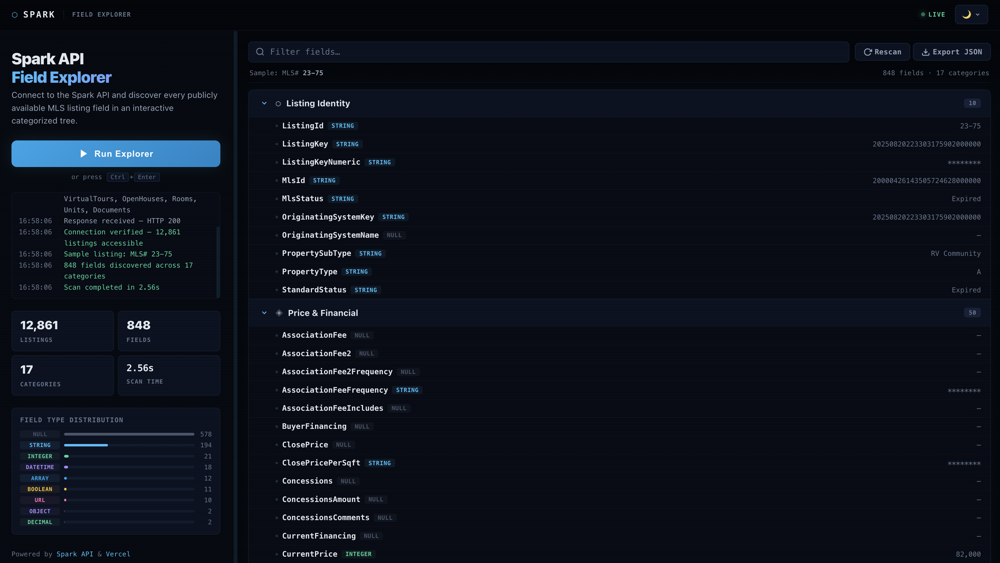

# ⬡ Spark Field Explorer

An interactive field discovery tool for the **Spark API by FBS**. Connect your own Spark API key and instantly explore every publicly available MLS listing field organized in a navigable, categorized tree.

[](https://vercel.com/new/clone?repository-url=...)




[](https://vercel.com/new/clone?repository-url=...)

🔗 **[Live Demo](https://spark-api-checker.vercel.app/)**

Built with **Next.js 14** on **Vercel Edge Runtime**.

---

## 🚀 Fork & Deploy in 3 Minutes

### Step 1 — Fork This Repository

1. Click the **Fork** button in the top-right corner of this GitHub page.
2. Select your GitHub account as the destination.
3. Wait for the fork to finish — you now have your own copy.

### Step 2 — Deploy to Vercel

1. Go to [vercel.com](https://vercel.com) and sign in with your GitHub account.
2. Click **"Add New…"** → **"Project"**.
3. Find your forked repository in the list and click **Import**.
4. Under **Environment Variables**, add the following:

| Variable | Required | Value |
|---|---|---|
| `SPARK_ACCESS_TOKEN` | **Yes** | Your Spark API bearer token from FBS |
| `SPARK_API_BASE_URL` | No | Defaults to `https://replication.sparkapi.com` — only change if your MLS uses a different endpoint |

5. Click **Deploy**.
6. Wait for the build to finish (usually under 60 seconds).
7. Click **"Visit"** to open your live app.

### Step 3 — Use Your Own Data

Once deployed, your app connects to **your** Spark API key. Click **Run Explorer** and the app will:

- Connect to the Spark API using your token
- Pull a sample listing from your MLS feed
- Scan every field on that listing
- Display all fields organized by category in an interactive tree

**To switch API keys later:**

1. Go to your Vercel project → **Settings** → **Environment Variables**.
2. Update `SPARK_ACCESS_TOKEN` with your new key.
3. Go to **Deployments** → click the **⋮** menu on the latest deployment → **Redeploy**.
4. Your app now loads data from the new key.

> **Note:** Your API token is stored **only** in Vercel's encrypted environment variables. It is never committed to your repository or exposed to the browser. All API calls happen server-side through Edge API routes.

---

## ✨ Features

### 🔍 One-Click Field Discovery
- Click **Run Explorer** to scan your Spark API connection.
- The app fetches a sample listing with all available expansions (Photos, Videos, VirtualTours, OpenHouses, Rooms, Units, Documents).
- Every field returned by the API is analyzed, categorized, and displayed.

### 🌳 Interactive Field Tree
- Fields are organized into **smart categories**:

| Category | What It Contains |
|---|---|
| **Listing Identity** | MLS number, listing key, status, property type |
| **Price & Financial** | List price, fees, taxes, assessments |
| **Location & Address** | City, state, zip, street address, county |
| **Property Characteristics** | Beds, baths, sqft, year built, stories, garage |
| **Interior Features** | Flooring, fireplace, appliances, HVAC |
| **Exterior & Lot** | Pool, roof, fencing, lot size, views |
| **Room Details** | Room-level data arrays |
| **School Information** | School districts and names |
| **Tax & Assessment** | Parcel numbers, zoning, tax amounts |
| **HOA & Community** | Association fees, amenities |
| **Agent & Office** | Listing agent, broker, office |
| **Dates & Timestamps** | List date, modification dates, DOM |
| **Media & Photos** | Photo arrays with URLs, captions, dimensions |
| **Marketing & Descriptions** | Public remarks, showing instructions |
| **Status & Compliance** | IDX opt-in, VOW, internet permissions |
| **Geographic & Map** | Latitude, longitude, coordinates |
| **Utility & Systems** | Electric, water, sewer, solar |
| **Other Fields** | Anything that doesn't fit above |

- **Click any category** to expand and see its fields.
- **Nested data** (like Photos or Rooms) is expandable with child fields shown inside.

### 🏷️ Color-Coded Type Badges
Every field shows its data type with a color-coded badge:

| Badge | Color | Examples |
|---|---|---|
| `STRING` | Blue | City, Address, PropertyType |
| `INTEGER` | Green | BedroomsTotal, YearBuilt |
| `DECIMAL` | Green | BathroomsTotalDecimal |
| `BOOLEAN` | Amber | PoolPrivateYN, InternetEntireListingDisplayYN |
| `DATETIME` | Purple | ListingContractDate, ModificationTimestamp |
| `URL` | Pink | Photo URIs, Virtual Tour links |
| `ARRAY` | Blue | Photos, Rooms, OpenHouses |
| `OBJECT` | Purple | Nested data structures |
| `NULL` | Gray | Fields present but empty |
| `TEXT (LONG)` | Blue | PublicRemarks, SyndicationRemarks |

### 📊 Stats Dashboard
After scanning, a stats bar shows:
- **Total Listings** — how many active listings your API key has access to
- **Fields Found** — total number of fields discovered (including nested)
- **Categories** — how many categories the fields were sorted into
- **Sample MLS#** — the listing ID used for the field scan

### 🎨 High-Tech Interface
- **Deep dark theme** with a near-black background (#030509)
- **Ambient glow orbs** — three floating gradient orbs (blue, purple, green) that animate slowly
- **Scanline overlay** — subtle CRT-style scanlines across the entire viewport
- **Monospace typography** — all data fields, badges, and code use monospace fonts
- **Gradient accents** — the hero title and buttons use blue-to-purple gradients
- **Decorative grid** — animated grid pattern on the landing page
- **Custom scrollbar** — thin, themed scrollbar matching the dark aesthetic
- **Smooth animations** — fade-up results, expanding tree nodes, hover glow effects
- **Responsive design** — works on desktop, tablet, and mobile

---

## 📡 API Endpoints

| Endpoint | Method | Description |
|---|---|---|
| `/api/spark-fields` | GET | Connects to the Spark API, fetches a sample listing with all expansions, analyzes every field, and returns a categorized tree structure. |
| `/api/spark-test` | GET | Simple connection test. Returns connected/failed status and total listing count. |
| `/api/spark-debug` | GET | Runs 5 diagnostic API tests and returns raw responses for troubleshooting. |

### `/api/spark-fields` Response Structure

```json
{
  "success": true,
  "connection": "connected",
  "totalListings": 12847,
  "sampleListingId": "20240815123456",
  "rawFieldCount": 247,
  "timestamp": "2025-01-15T10:30:00.000Z",
  "fieldTree": {
    "Listing Identity": {
      "ListingId": {
        "type": "string",
        "value": "20240815123456",
        "sample": "20240815123456"
      },
      "StandardStatus": {
        "type": "string",
        "value": "Active",
        "sample": "Active"
      }
    },
    "Price & Financial": {
      "ListPrice": {
        "type": "integer",
        "value": 450000,
        "sample": "450,000"
      }
    },
    "Media & Photos": {
      "Photos": {
        "type": "array[25] of objects",
        "sample": "25 items — 12 fields each",
        "children": {
          "Uri640": { "type": "url", "value": "https://...", "sample": "https://..." },
          "Primary": { "type": "boolean", "value": true, "sample": "true" }
        }
      }
    }
  }
}
[](https://vercel.com/new/clone?repository-url=...)
